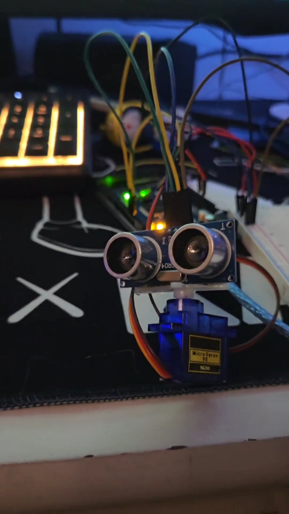
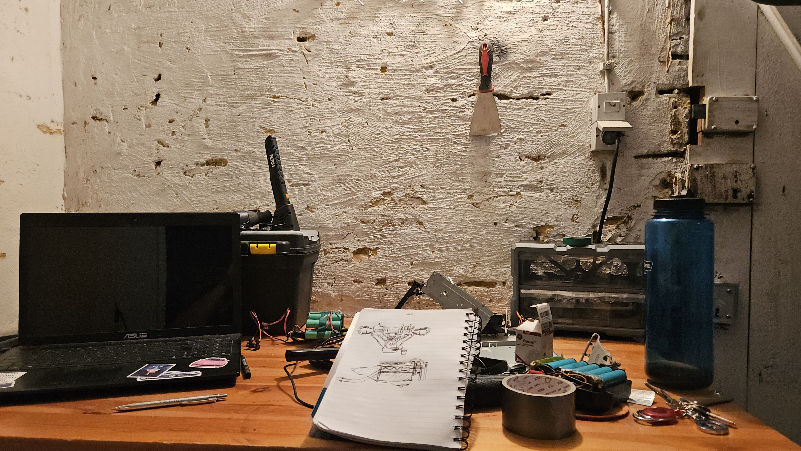
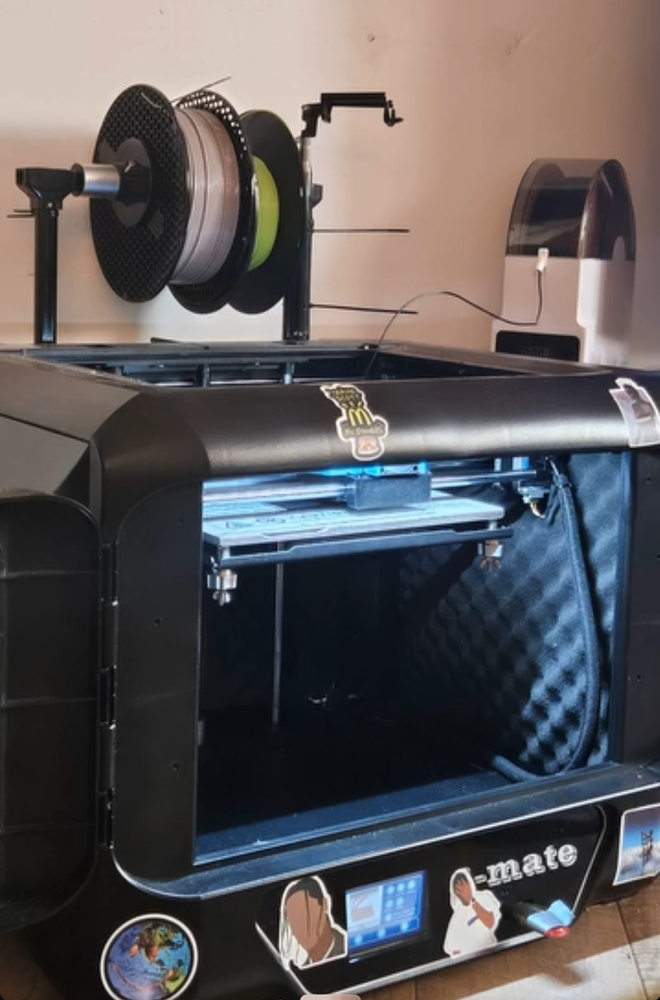
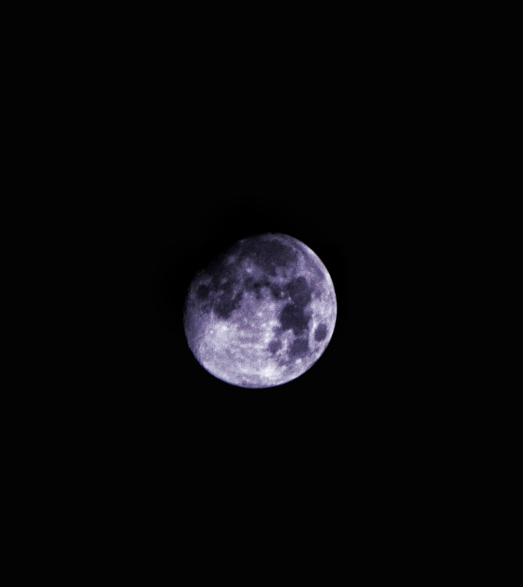
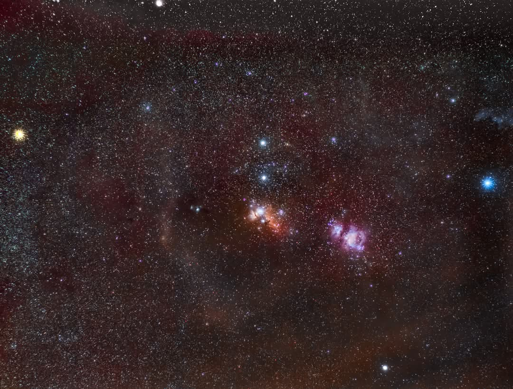

# Senhadji Ahmed Mohmed 

## über mich

#### Hallo, mein Name ist Senhadji Ahmed Mohamed. Schon als Kind war ich von der Funktionsweise der Dinge fasziniert. Ich habe stets versucht, Dinge zu reparieren und zu verstehen, sei es durch das Zerlegen von Objekten oder das improvisierte Reparieren mit begrenzten Werkzeugen wie einem Messer als Schraubenzieher und einem Block als Hammer. Obwohl es mir nicht vergönnt war, eine Universität zu besuchen, habe ich nie den Glauben an meine Träume verloren. Inspiriert von Wissenschaftlern wie Michael Faraday, die ohne formale Ausbildung große Beiträge leisteten, frage ich mich oft, wie viele der großen Denker der Vergangenheit ohne Zertifikate weitergemacht haben. Ich verfolge nun entschlossen meinen eigenen Weg.

## Coding

In meiner Freizeit habe ich viel mit Linux und Bash-Scripting experimentiert und dabei Programmierkenntnisse in C++ für Arduino-Projekte erworben. Auch mit den Grundlagen von HTML habe ich mich beschäftigt, um meine ersten Webseiten zu erstellen und mein Verständnis für Webentwicklung zu erweitern.

## Physik

Besonders fasziniert mich die Physik, und hätte ich die Möglichkeit, hätte ich Physik studiert. Leider wird mein ausländisches Abitur in Deutschland nicht anerkannt, aber ich bin entschlossen, mein Wissen in Physik und anderen technischen Bereichen weiter auszubauen und weiterhin zu lernen.

## 3D-Druck und Modellierung

Ein weiterer Bereich, der mich begeistert, ist 3D-Druck und Modellierung. Ich finde es spannend, wie diese Technologien die Fertigung revolutionieren und neue Möglichkeiten für kreative und funktionale Projekte bieten. Es ist faszinierend, wie man mit einem 3D-Drucker und den richtigen Modellen nahezu alles erstellen kann.

## Aktuelle Hobbies

Momentan ist mein größtes Interesse die Astronomie und Astrofotografie. Ich liebe es, den Himmel zu beobachten und die Schönheit des Universums einzufangen. Diese Leidenschaft motiviert mich, neue Technologien und Methoden zu erlernen, um noch präzisere und beeindruckendere Aufnahmen zu machen.

Ich freue mich darauf, meine Reise in der Welt der Technik und Wissenschaft fortzusetzen und meine Projekte hier zu teilen.
